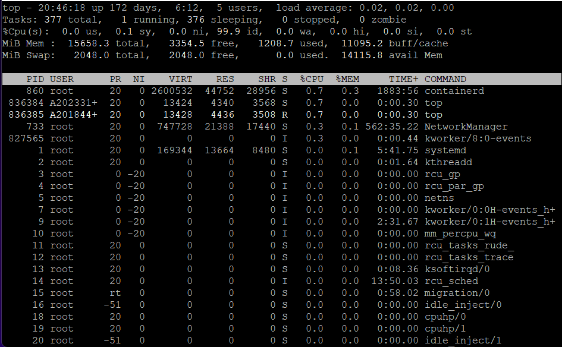

# **리눅스 명령어**

## **top**

* 유닉스 계열의 시스템에서 프로세스 목록을 CPU 사용률이 높은 것부터 보여준다.

* top 명령어는 시스템의 프로세스와 메모리 사용상태를 5초의 간격으로 업데이트 하여 화면에 출력한다.

* 어떤 프로세스가 CPU를 많이 차지하고 있는지 체크할때 실시간으로 볼 수 있다. 

### **top 명령어 실행 후 결과(Putty)** 

***

## **ps**

* process status의 약자이다. 즉, 프로세스의 상태를 확인할 수 있다. 

* 해당 명령어를 이용해서 현재 실행중인 프로세스의 목록과 상태를 알 수 있다. 

### **ps 명령어 실행 후 결과(Putty)**

***

## **jobs**

* jobs 명령어는 작업의 상태를 표시하는 명령어다.

* 현재 쉘 세션에서 실행시킨 백그라운드 작업 목록이 출력되며, 각 작업에는 번호가 붙어있어 kill 명령어 뒤에 '%번호'등으로 사용할 수 있다.  

* jobs 명령어는 현재 쉘 프로세스의 자식 백그라운드 프로세스들을 보여준다고 생각하면 된다. 

### **jobs로 출력되는 백그라운드 작업의 상태값**

|       상태       	|                        설명              	|
|:----------------:	|:----------------------------------------:	|
|      Running     	|           작업이 계속 진행중임           	|
|       Done       	|         작업이 완료되어 0을 반환         	|
|    Done(code)    	| 작업이 종료되었으며 0이 아닌 코드를 반환 	|
|      Stopped     	|             작업이 일시 중단             	|
| Stopped(SIGTSTP) 	|     SIGTSTP 시그널이 작업을 일시 중단    	|
| Stopped(SIGSTOP) 	|     SIGSTOP 시그널이 작업을 일시 중단    	|
| Stopped(SIGTTIN) 	|     SIGTTIN 시그널이 작업을 일시 중단    	|
| Stopped(SIGTTOU) 	|     SIGTTOU 시그널이 작업을 일시 중단    	|

***

## **kill**

* 프로세스에 시그널을 보내 원하는 작업을 하게 하는 명령어이다.
* -s 옵션으로 시그널을 지정하지 않으면 기본 시그널 값이 정상종료(SIGTERM,15)이기 때문에 일반적으로 프로세스 종료 명령어로 많이 알려져 있다. 
* kill 명령어는 내부적으로  kill()이란 시스템 콜을 사용하여 구현하고,  프로세스 식별자(PID)로 지시한 프로세스와 프로세스 그룹 식별자(PGID)로 지시한 프로세스 그룹에 시그널을 보낸다.

### **시그널**
* 시그널이란 인터럽트의 일종으로 어떤 이벤트의 발생을 프로세스에게 알려주는 것이다. 
* 특정 이벤트가 발생했을 때 프로세스에게 전달하는 신호(메시지)이다. 
* 리눅스에서 프로세스끼리 통신할 때 사용한다.
* 시그널 이벤트로는 HW 예외(나누기 0), SW 상태, 사용자 입력, 시스템 콜(kill) 등이 있다. 

### **주요 시그널**
| 시그널 번호 	|     시그널    	|                                     설명                                    	|
|:-----------:	|:-------------:	|:---------------------------------------------------------------------------:	|
|      1      	|  SIGHUP(HUP)  	|                          종료(연결 끊기, 실행 종료)                         	|
|      2      	|  SIGINT(INT)  	|                           종료(CTRL + C, 인터럽트)                          	|
|      3      	| SIGQUIT(QUIT) 	|                           종료 + 코어 덤프(CTRL+\)                          	|
|      9      	| SIGKILL(KILL) 	|          종료(강제 종료, 프로그램에서 핸들러를 만들 수 없는 시그널          	|
|      15     	| SIGTERM(TERM) 	|                               종료(정상 종료)                               	|
|      18     	| SIGCONT(CONT) 	| 정지 된 프로세스 재실행 (STOP 이나 TSTP에 의해 정지된 프로세스를 다시 실행) 	|
|      19     	| SIGSTOP(STOP) 	|               정지 (프로그램에서 핸드러를 만들 수 없는 시그널)              	|
|      20     	| SIGTSTP(TSTP) 	|                               정지 (CTRL + Z)                               	|

***

## **참고 사이트 링크**
[[linux] top 명령어. CPU 사용률 확인[Website].(2023.05.24)](https://cheershennah.tistory.com/172)

[[LINUX] 리눅스 마스터 2급::ps명령어 정리(옵션,사용예시,프로세스 상태 등)[Website].(2023.05.24)](https://hoho325.tistory.com/429)

[[Linux] jobs 명령어 사용법[Website].(2023.05.24)](https://hbase.tistory.com/265)

[[Linux] 리눅스 시그널 명령어(프로세스 종료) - kill[Website].(2023.05.24)](https://veneas.tistory.com/entry/Linux-%EB%A6%AC%EB%88%85%EC%8A%A4-%EC%8B%9C%EA%B7%B8%EB%84%90-%EB%AA%85%EB%A0%B9%EC%96%B4%ED%94%84%EB%A1%9C%EC%84%B8%EC%8A%A4-%EC%A2%85%EB%A3%8C-kill)
